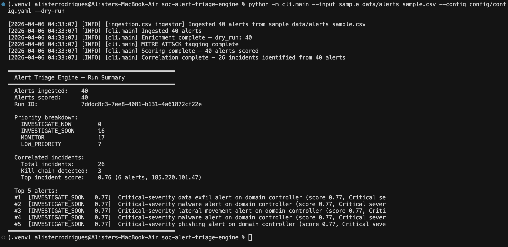
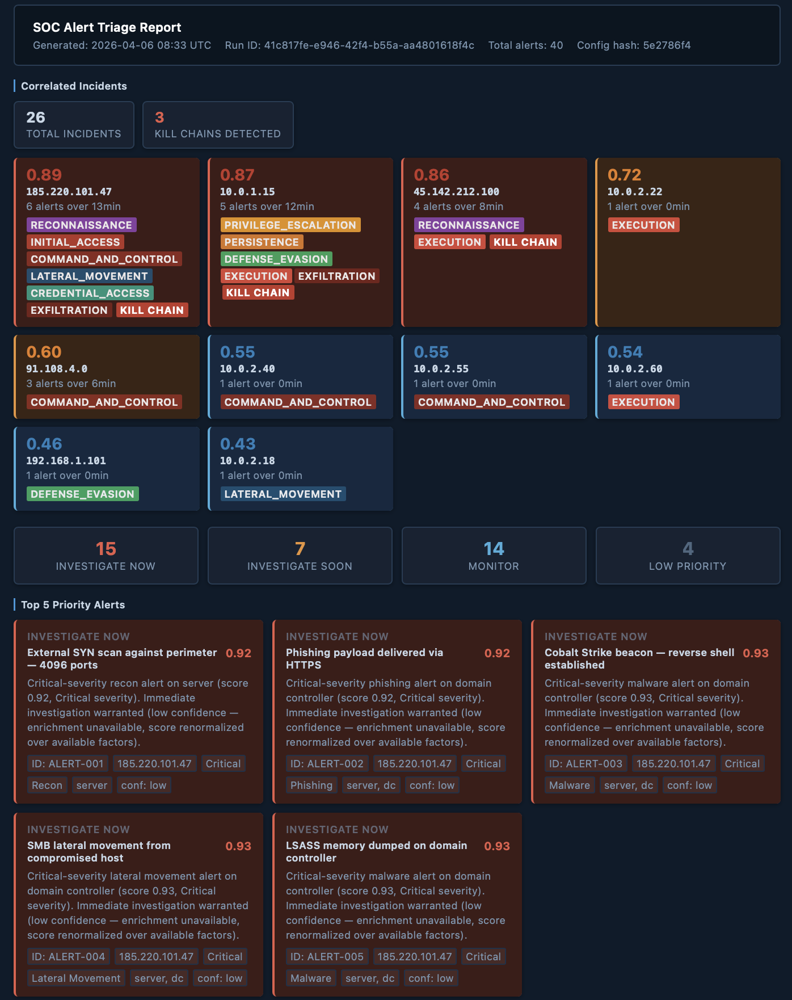
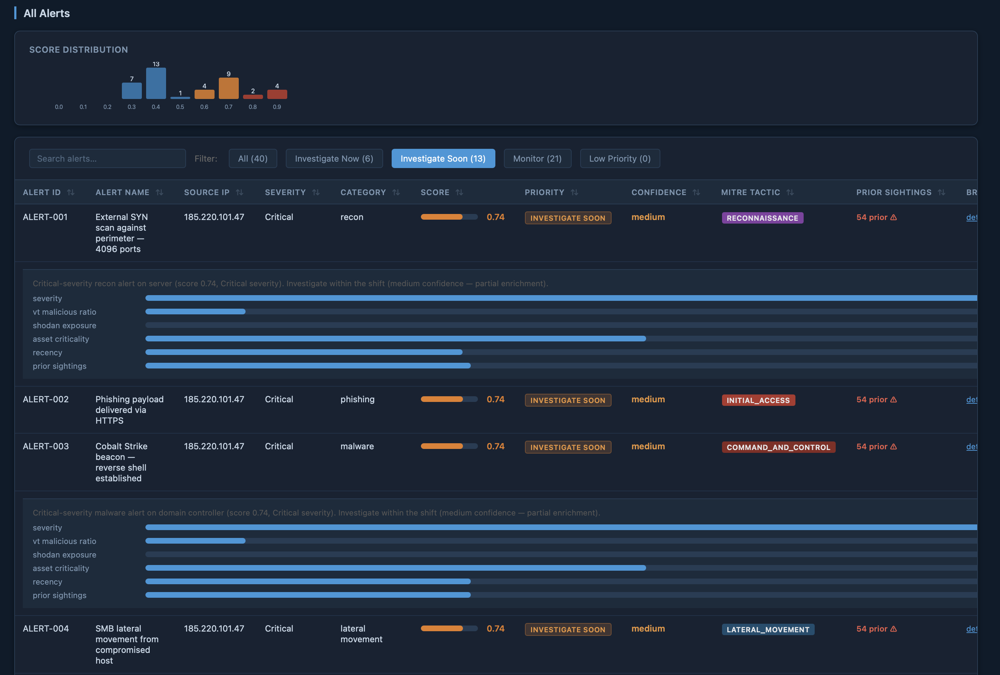
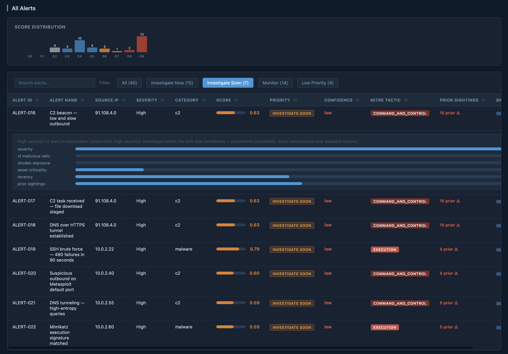
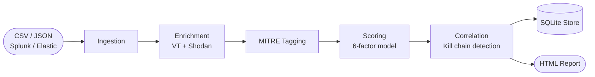

# SOC Alert Triage Engine

[](https://github.com/alisterrodrigues/soc-alert-triage-engine/actions/workflows/ci.yml)
[](https://www.python.org/downloads/)
[](LICENSE)
[](https://attack.mitre.org/)
[](#sources)

An engineered Python CLI that ingests security alerts from any source, enriches them with VirusTotal and Shodan threat intelligence, scores priority using a 6-factor weighted model, detects correlated incidents and kill chains, and generates a self-contained HTML analyst report.

---

## What it does

Security operations centers deal with alert fatigue. A typical SIEM generates hundreds of alerts per shift, most of which are noise. The question an analyst asks every time is: **which of these actually needs my attention right now?**

This tool answers that systematically. It pulls alerts from a file export, Splunk, or Elasticsearch; enriches each public source IP against VirusTotal and Shodan; scores priority using a configurable weighted model; groups related alerts into time-windowed incidents; and flags multi-stage kill chains. The output is a scored, sorted, filterable HTML analyst report.

---

## Screenshots

### Terminal output — dry-run


### HTML report — correlated incidents and priority overview


### HTML report — live enrichment, ATT&CK tags, and score breakdowns


### HTML report — Investigate Soon filter with score distribution


---

## Pipeline



| Stage | What happens |
|---|---|
| **Ingestion** | CSV, JSON, Splunk REST API, or Elasticsearch query → normalized `Alert` objects. UTF-8 BOM handled. JSON null-safe. |
| **Enrichment** | VirusTotal IP reputation + Shodan port/CVE lookup per public source IP. File-based cache (1hr TTL). Private/reserved IPs skipped. |
| **MITRE Tagging** | Each alert mapped to ATT&CK tactic and technique via rule ID prefix → category fallback lookup. |
| **Scoring** | 6-factor weighted model. Missing enrichment renormalized over available factors — not zeroed out. |
| **Correlation** | Alerts grouped by source IP within a 15-minute window. Kill chain fires when tactic chain spans ≥ 2 ATT&CK stages. |
| **Store** | All results persisted to SQLite with score breakdown, enrichment fields, and run metadata. |
| **Report** | Self-contained HTML — no CDN, works offline. Score histogram, filterable table, MITRE badges, expandable breakdowns. |

---

## Quick Start

**Requirements:** Python 3.11+

```bash
# Clone and set up
git clone https://github.com/alisterrodrigues/soc-alert-triage-engine.git
cd soc-alert-triage-engine
python -m venv .venv && source .venv/bin/activate
pip install -r requirements.txt

# Dry-run against sample data — no API keys needed
python -m cli.main \
  --input sample_data/alerts_sample.csv \
  --config config/config.yaml \
  --dry-run --report

# Live enrichment run
export VT_API_KEY=your_virustotal_key
export SHODAN_API_KEY=your_shodan_key
python -m cli.main \
  --input sample_data/alerts_sample.csv \
  --config config/config.yaml \
  --report
```

### Splunk source

```bash
export SPLUNK_USERNAME=admin
export SPLUNK_PASSWORD=your_password
python -m cli.main --source splunk --config config/config.yaml --report
```

### Elasticsearch source

```bash
export ELASTIC_API_KEY=your_api_key
python -m cli.main --source elastic --config config/config.yaml --report
```

---

## Scoring Model

Each alert receives a score in `[0.0, 1.0]` computed as a weighted sum of six factors:

| Factor | Weight | Description |
|---|---|---|
| Severity | 0.25 | `critical`=1.0, `high`=0.75, `medium`=0.45, `low`=0.20 |
| VT malicious ratio | 0.20 | Fraction of VirusTotal engines flagging the source IP |
| Shodan exposure | 0.15 | Weighted port score + CVE count (RDP/SMB score higher than HTTP) |
| Asset criticality | 0.15 | `dc`/`server`=1.0, `cloud`=0.5, `workstation`/other=0.2 |
| Recency | 0.15 | Exponential decay, 6-hour half-life, floor at 0.10 |
| Prior sightings | 0.10 | `1 - 0.7ⁿ` where n = prior appearances of source IP in last 7 days |

**Missing enrichment is renormalized, not zeroed.** When VT and Shodan are unavailable, the remaining weights scale up proportionally so structural signals (severity, asset criticality, recency) carry their full weight. The result is marked `confidence: low` — not suppressed. See [docs/scoring_model.md](docs/scoring_model.md) for the full formula.

Scores map to priority labels:

| Score | Label |
|---|---|
| ≥ 0.80 | `INVESTIGATE_NOW` |
| ≥ 0.55 | `INVESTIGATE_SOON` |
| ≥ 0.30 | `MONITOR` |
| < 0.30 | `LOW_PRIORITY` |

---

## Incident Correlation

Alerts sharing a source IP within a configurable time window (default: 15 minutes) are grouped into a `CorrelatedIncident`:

```
combined_score = peak * 0.6 + mean * 0.3 + min(alert_count / 10, 1.0) * 0.1
```

Kill chain detection fires when the incident's tactic chain spans two or more distinct ATT&CK stages — for example `RECONNAISSANCE → LATERAL_MOVEMENT → CREDENTIAL_ACCESS → EXFILTRATION`. Private/RFC1918 IPs are fully included in correlation; internal lateral movement is exactly the pattern worth detecting.

---

## MITRE ATT&CK Tagging

Each alert is tagged with a tactic and technique. Rule ID prefix takes priority over category when both match. Mappings live in `correlation/mitre_mappings.yaml` and can be extended without code changes.

| Rule ID prefix / Category | Tactic | Technique |
|---|---|---|
| `RDP-*` | LATERAL_MOVEMENT | T1021.001 — Remote Desktop Protocol |
| `PERSIST-*` | PERSISTENCE | T1547 — Boot or Logon Autostart Execution |
| `CRED-*` | CREDENTIAL_ACCESS | T1003 — OS Credential Dumping |
| `EXFIL-*` | EXFILTRATION | T1041 — Exfiltration Over C2 Channel |
| category: `c2` | COMMAND_AND_CONTROL | T1071 — Application Layer Protocol |
| category: `phishing` | INITIAL_ACCESS | T1566 — Phishing |

---

## Alert Input Format

For file-based ingestion, CSV or JSON must include these fields:

| Field | Required | Notes |
|---|---|---|
| `alert_id` | Yes | Unique alert identifier |
| `timestamp` | Yes | ISO 8601, e.g. `2026-04-06T05:02:11Z` |
| `source_ip` | Yes | IPv4 address |
| `alert_name` | Yes | Human-readable description |
| `severity` | No | `critical`, `high`, `medium`, `low` (defaults to `low`) |
| `category` | No | `malware`, `phishing`, `lateral_movement`, `c2`, `data_exfil`, `recon`, `other` |
| `destination_ip` | No | |
| `destination_port` | No | Integer |
| `rule_id` | No | Drives MITRE prefix mapping |
| `asset_tags` | No | Comma-separated: `dc`, `server`, `endpoint`, `cloud`, `workstation` |
| `raw_payload` | No | JSON string of raw SIEM event |
| `analyst_notes` | No | Pre-existing annotations |

`sample_data/` contains 40 alerts across four realistic attack scenarios — an APT intrusion chain, insider threat, ransomware staging, and C2 beaconing — designed to trigger kill chain detection and demonstrate score spread.

---

## Configuration

All parameters are in `config/config.yaml`. Nothing is hardcoded in library code.

```yaml
scoring:
  weights:                     # Must sum to 1.0
    severity: 0.25
    vt_malicious_ratio: 0.20
    shodan_exposure: 0.15
    asset_criticality: 0.15
    recency: 0.15
    prior_sightings: 0.10
  baseline_lookback_days: 7    # Prior sightings history window
  recency:
    half_life_hours: 6.0       # Recency decay rate
    floor: 0.10                # Minimum recency score

correlation:
  window_minutes: 15           # Time window for incident grouping

enrichment:
  virustotal:
    rate_limit_per_min: 4      # Free tier: 4 req/min
  cache:
    ttl_seconds: 3600          # Cache TTL per IP
```

---

## Export

```bash
# Export to JSON
python -m cli.main --input alerts.csv --config config/config.yaml --export json

# Export to CSV and JSON
python -m cli.main --input alerts.csv --config config/config.yaml --export both

# Custom output directory
python -m cli.main --input alerts.csv --config config/config.yaml --output-dir /tmp/triage-out --report
```

---

## Development

```bash
pip install -r requirements-dev.txt
pytest tests/ -v
pytest tests/ -v --cov=. --cov-report=term-missing
```

111 tests across five modules. No network calls in any test.

---

## Project Structure

```
soc-alert-triage-engine/
├── cli/
│   └── main.py                   # Entry point and pipeline orchestration
├── ingestion/
│   ├── __init__.py                # Alert dataclass, _validate_and_build, _opt_str
│   ├── csv_ingestor.py
│   └── json_ingestor.py
├── sources/
│   ├── base.py                    # AlertSource ABC
│   ├── file_source.py
│   ├── splunk_source.py
│   └── elastic_source.py
├── enrichment/
│   ├── virustotal.py
│   ├── shodan_lookup.py
│   └── cache.py
├── correlation/
│   ├── engine.py                  # Time-windowed incident grouping
│   ├── tagger.py                  # MITRE ATT&CK tagging
│   └── mitre_mappings.yaml        # Tactic/technique lookup table
├── scoring/
│   ├── scorer.py                  # 6-factor weighted model
│   └── constants.py               # Shared priority label thresholds
├── store/
│   └── alert_db.py                # SQLite persistence
├── reporting/
│   └── html_report.py             # Self-contained HTML report generator
├── tests/
│   ├── test_ingestion.py
│   ├── test_enrichment.py
│   ├── test_scoring.py
│   ├── test_correlation.py
│   └── test_report.py
├── sample_data/
│   ├── alerts_sample.csv          # 40 alerts across 4 attack scenarios
│   └── alerts_sample.json
├── docs/
│   ├── architecture.md
│   ├── scoring_model.md
│   └── screenshots/
├── config/
│   └── config.yaml                # All tunables
├── .env.example
├── .github/workflows/ci.yml
├── pyproject.toml
├── requirements.txt
└── requirements-dev.txt
```

See [docs/architecture.md](docs/architecture.md) for module-level documentation and design decisions.

---

## Design Decisions

**Enrichment absent ≠ threat absent.** Missing VT/Shodan data renormalizes the model rather than silently deflating scores. An `INVESTIGATE_NOW` with `confidence: low` means the structural signals are alarming but the external intelligence layer couldn't confirm — more honest and more actionable than a suppressed score.

**Private IPs are not excluded from correlation.** RFC1918 addresses are short-circuited from external enrichment APIs (no useful data, wastes quota). But they are fully included in incident grouping — internal lateral movement is exactly the pattern worth detecting.

**No hardcoded values.** Weights, thresholds, severity mappings, rate limits, cache TTL, time windows — everything lives in `config/config.yaml`. Tuning for a specific environment requires zero code changes.

**Self-contained report.** The HTML report inlines all CSS and JavaScript. No CDN, no external fonts, no runtime dependencies. It renders identically online and offline, can be emailed as a single file, and does not exfiltrate alert data to external servers.

**Source provider abstraction.** Adding a new alert source — AWS Security Hub, Microsoft Sentinel, a custom webhook — requires one class implementing `fetch()` and a field mapping function. Enrichment, scoring, and reporting are untouched.

---

## Known Limitations

- Enrichment is source-IP-centric. For phishing and exfiltration alerts, the destination entity is often more relevant than the source.
- The VT rate limiter is process-local and not thread-safe. Concurrent runs will not coordinate API timing.
- Prior sightings does not deduplicate within a single run. High-volume bursts may inflate future sighting counts.
- Splunk and Elastic adapters do not implement checkpoint-based deduplication for continuous polling.
- Scoring weights reflect operational judgment, not parameters learned from historical ground truth.
