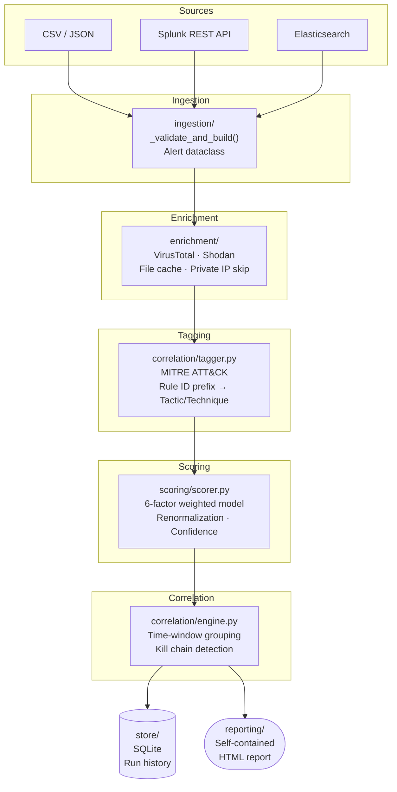
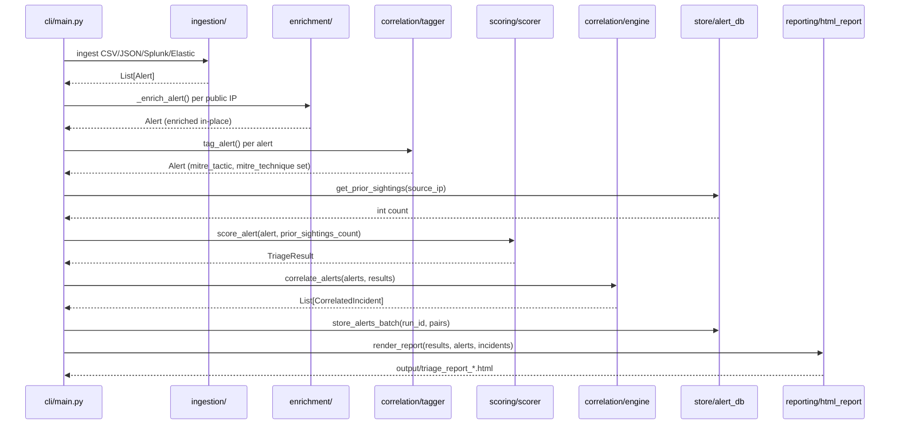
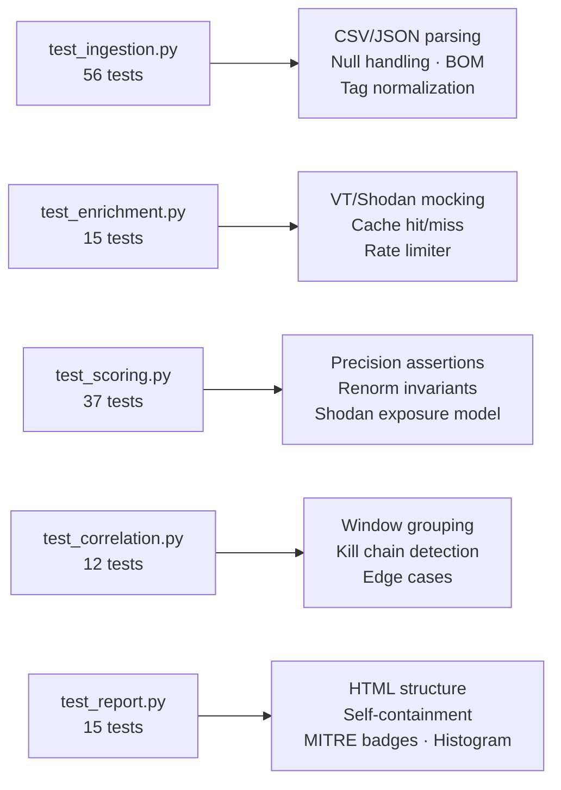

# Architecture — SOC Alert Triage Engine

This document describes the module structure, data flow, and design decisions behind the triage engine.

---

## Pipeline Overview



---

## Alert Lifecycle



---

## Module Reference

### `ingestion/`

Normalizes raw alert data from any source into the canonical `Alert` dataclass.

- **`__init__.py`** — Defines `Alert` and `_validate_and_build()`. The `Alert` dataclass is the single canonical representation used by every downstream stage. `_opt_str()` prevents Python `None` values from becoming the literal string `"None"` when ingesting JSON null fields. Asset tags are lowercased at parse time so `"DC"` and `"server"` both match scoring logic.
- **`csv_ingestor.py`** — Opens files with `utf-8-sig` encoding to transparently handle UTF-8 BOM headers produced by Excel and many SIEMs.
- **`json_ingestor.py`** — Expects a JSON array at the root. Single-object roots return empty.

**Design decision:** Both ingestors delegate to the same `_validate_and_build()`. Severity normalization, category validation, port parsing, and tag lowercasing happen once, in one place.

---

### `sources/`

Provider abstraction that decouples alert acquisition from the rest of the pipeline.

- **`base.py`** — `AlertSource` ABC with `fetch() -> list` and `source_name() -> str`.
- **`file_source.py`** — Wraps the file ingestors. Returns `Alert` objects directly (ingestors already call `_validate_and_build`).
- **`splunk_source.py`** — Queries Splunk's REST jobs API with `exec_mode=oneshot`. Maps Splunk event fields to the `Alert` schema. Credentials from environment variables. Returns `[]` on any connection, auth, or parse failure.
- **`elastic_source.py`** — Queries an Elasticsearch index with a `@timestamp` date-range filter. Prefers API key auth; falls back to username/password. The `elasticsearch` package is imported inside `fetch()` so the tool works without it installed unless `--source elastic` is used.

**Design decision:** Adding a new source (AWS Security Hub, Microsoft Sentinel) requires one class implementing `fetch()` and a field mapping function. Enrichment, scoring, and reporting are untouched.

---

### `enrichment/`

Enriches `Alert` objects in-place with external threat intelligence.

- **`virustotal.py`** — Queries the VT IP reputation endpoint. Returns `vt_malicious_ratio` (float 0–1), `vt_country`, `vt_as_owner`. Rate-limited via module-level `_last_call_time` (single-process assumption).
- **`shodan_lookup.py`** — Queries Shodan for open ports, known CVEs, org. The `shodan` library is imported inside `lookup_ip()` for graceful failure if not installed.
- **`cache.py`** — File-based JSON cache keyed by `{module}_{safe_ip}` in `output/.cache/`. TTL-checked at read time. Files written with `chmod 600`.

**Design decision:** Private/reserved/non-routable IPs — RFC1918, loopback (127.x), link-local (169.254.x) — are short-circuited before any API call. They return no useful enrichment data and would waste rate-limited API quota. They are still fully included in incident correlation.

---

### `correlation/`

Two responsibilities: MITRE ATT&CK tagging and time-windowed incident correlation.

- **`tagger.py`** — Maps `alert.category` and `alert.rule_id` prefix to an ATT&CK tactic and technique. Rule ID prefix takes priority when both match. Mappings loaded once at import time from `mitre_mappings.yaml`.
- **`mitre_mappings.yaml`** — Human-editable lookup table. 7 category entries, 16 rule ID prefix entries. Extend without code changes.
- **`engine.py`** — Groups alerts by `source_ip` within a configurable time window (default 15 minutes). Gap between consecutive same-IP alerts exceeding the window closes the current incident and starts a new one. Combined incident score: `peak * 0.6 + mean * 0.3 + min(count/10, 1.0) * 0.1`. Kill chain fires when tactic chain spans ≥ 2 distinct ATT&CK stages.

**Design decision:** Private-IP alerts are included in correlation. Internal lateral movement — compromised host pivoting through RFC1918 space — is among the most significant patterns to detect and must not be excluded because Shodan/VT returned nothing.

---

### `scoring/`

Computes a normalized priority score for each `Alert`.

- **`scorer.py`** — 6-factor weighted model. When enrichment factors are `None`, missing weights are redistributed across available factors so the model remains calibrated. Confidence degrades when enrichment is absent.
- **`constants.py`** — Single source of truth for `PRIORITY_LABELS` thresholds, imported by both `scorer.py` and `correlation/engine.py` to prevent divergence.

See [scoring_model.md](scoring_model.md) for the full formula, port weight table, and tuning guide.

**Design decision:** Missing enrichment is renormalized, not zeroed. A high-severity alert on a domain controller scores correctly even without VT/Shodan data — and the analyst sees `confidence: low`, not a suppressed score that hides a real threat.

---

### `store/`

Persists all run data to SQLite.

- **`alert_db.py`** — Two tables: `run_metadata` (one row per run) and `triage_results` (one row per alert per run). Batch inserts via `executemany` in a single transaction. Foreign key enforcement on. Indexes on `(run_id, score DESC)` and `(source_ip, timestamp)`. `get_prior_sightings()` counts prior appearances of a source IP within a configurable lookback window.

**Design decision:** The DB connection is opened before the scoring loop so `get_prior_sightings()` can query historical data during scoring. The run record (`start_run()`) is not created until after all scores are ready to store — scoring queries do not create orphaned run records.

---

### `reporting/`

Generates a self-contained HTML analyst report.

- **`html_report.py`** — All HTML, CSS, and JavaScript inlined. No CDN dependencies. Works offline. Sections: correlated incidents panel (with kill chain badges and tactic chains), score distribution histogram, priority summary cards, sortable/filterable/searchable alert table with MITRE tactic column, prior sightings column, and expandable per-alert score breakdowns. All user-supplied data passes through `_esc()` before insertion.

---

## Configuration Reference

All tunables live in `config/config.yaml`. No hardcoded values in library code.

| Section | Key | Purpose |
|---|---|---|
| `pipeline` | `log_level` | Logging verbosity |
| `pipeline` | `dry_run` | Skip all API calls (also settable via `--dry-run`) |
| `pipeline` | `output_dir` | Default output directory |
| `pipeline` | `db_path` | SQLite database path |
| `enrichment.virustotal` | `enabled`, `api_key_env`, `rate_limit_per_min` | VT control |
| `enrichment.shodan` | `enabled`, `api_key_env` | Shodan control |
| `enrichment.cache` | `ttl_seconds`, `cache_dir` | Cache behaviour |
| `sources.splunk` | `host`, `port`, `username_env`, `password_env`, `search` | Splunk connection |
| `sources.elastic` | `host`, `api_key_env`, `index`, `lookback_minutes` | Elastic connection |
| `scoring.weights` | Six factor keys | Must sum to 1.0 |
| `scoring.severity_map` | `critical`→`low` | Severity-to-float mapping |
| `scoring.confidence_thresholds` | `high_confidence` | Score threshold for high confidence |
| `scoring.baseline_lookback_days` | integer | Prior sightings history window |
| `scoring.recency` | `half_life_hours`, `floor` | Recency decay parameters |
| `correlation` | `window_minutes` | Time window for incident grouping |
| `correlation` | `min_alerts_per_incident` | Minimum alerts per returned incident |
| `reporting` | `highlight_top_n` | Number of priority cards shown |

---

## Testing

The test suite uses only the Python standard library plus `pytest`. No network calls, no real databases, no live API calls.



```bash
pytest tests/ -v                                    # run all 111 tests
pytest tests/ -v --cov=. --cov-report=term-missing  # with coverage
```

---

## Operational Notes

**Single-process design.** The rate limiter, cache, and DB connection are not concurrent-safe. Running two instances against the same cache directory or database may produce torn writes or duplicate run records.

**Enrichment is best-effort.** API failures, timeouts, and private IPs set `enrichment_source` to values other than `"live"`. The scoring model handles each case explicitly — renormalization for missing data, confidence degradation for partial data.

**Recency is runtime-calculated.** Scores drift over time because recency uses the wall clock at scoring time. The database stores the score at the moment of the run.

**Prior sightings requires accumulated history.** On the first run against a fresh database, all prior sightings counts are zero. The factor becomes meaningful after several runs.

**Splunk and Elastic adapters are integration-tested, not production-hardened.** They handle auth failures and connection errors gracefully but do not implement pagination or checkpoint-based deduplication. For high-volume environments, add a checkpoint file or use Splunk's `latest` search parameter.
