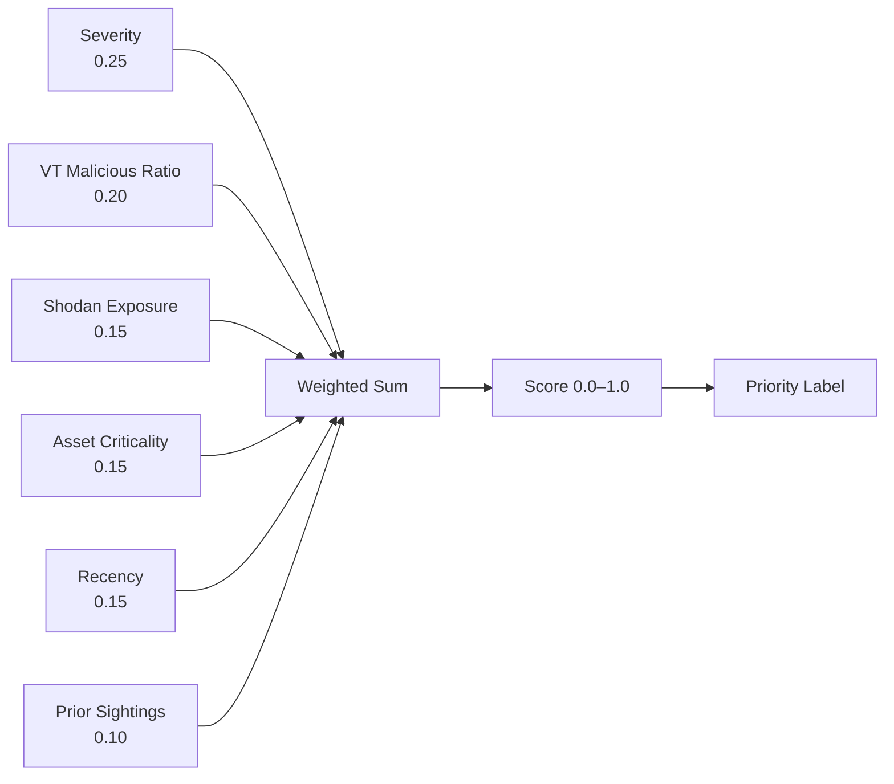
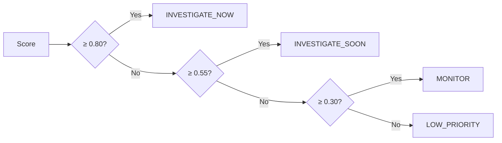

# Scoring Model — SOC Alert Triage Engine

This document describes the 6-factor weighted scoring model used to assign priority scores to alerts.

---

## Overview

Each alert receives a score in `[0.0, 1.0]`. The score is a weighted sum of six normalized factors. Weights are configurable in `config/config.yaml` and must sum to 1.0.



| Factor | Weight | Source |
|---|---|---|
| Severity | 0.25 | Alert metadata |
| VT malicious ratio | 0.20 | VirusTotal API |
| Shodan exposure | 0.15 | Shodan API |
| Asset criticality | 0.15 | Alert `asset_tags` field |
| Recency | 0.15 | Alert `timestamp` field |
| Prior sightings | 0.10 | SQLite run history |

---

## Factor Definitions

### 1. Severity

Maps the alert severity string to a float using `config.scoring.severity_map`:

| Severity | Score |
|---|---|
| `critical` | 1.00 |
| `high` | 0.75 |
| `medium` | 0.45 |
| `low` | 0.20 |

Unrecognized values default to `low` at ingestion time.

### 2. VT Malicious Ratio

The fraction of VirusTotal engines that flagged the source IP:

```
vt_score = malicious_count / total_engine_count
```

Range: `[0.0, 1.0]`. A ratio of 0.40 means 40% of VT engines returned a positive detection.

### 3. Shodan Exposure

Computed from open ports and known CVEs using a service-weighted model:

```
port_score = sum(port_weight for each open port), capped at 0.60
vuln_score = count(CVEs) * 0.12, capped at 0.40
shodan_exposure = min(port_score + vuln_score, 1.0)
```

Port weight table:

| Risk tier | Ports | Weight each |
|---|---|---|
| High | 3389 (RDP), 445 (SMB), 5900 (VNC), 1433 (MSSQL), 9200 (Elasticsearch), 27017 (MongoDB), 6379 (Redis), 4444 (Metasploit), 8080 (alt-HTTP), 2375 (Docker) | 0.15 |
| Medium | 22 (SSH), 21 (FTP), 23 (Telnet), 25 (SMTP), 3306 (MySQL), 5432 (PostgreSQL), 5984 (CouchDB), 11211 (Memcached), 2181 (Zookeeper) | 0.07 |
| Other | All remaining ports | 0.02 |

**Why weighted over raw counts:** Port 3389 exposed to the internet is not equivalent to port 80. A web server with many open ports should not outscore an RDP-accessible Windows host with one. The weighted model reflects real-world attack surface prioritization.

When `shodan_open_ports` is populated from a live or cached Shodan lookup, the weighted model is used. When only a pre-computed `shodan_exposure_score` float is available (e.g. from a third-party import), it is used directly.

### 4. Asset Criticality

Derived from `asset_tags`:

| Tags contain | Score |
|---|---|
| `dc` or `server` | 1.00 |
| `cloud` | 0.50 |
| `workstation` or none | 0.20 |

Tags are normalized to lowercase at ingestion time.

### 5. Recency

Exponential half-life decay with a 6-hour half-life and a floor of 0.10 (configurable):

```
recency_score = max(exp(-ln(2) * age_hours / half_life), floor)
```

| Alert age | Score |
|---|---|
| 10 minutes | ~0.98 |
| 1 hour | ~0.89 |
| 6 hours | ~0.50 |
| 12 hours | ~0.25 |
| 24 hours+ | 0.10 (floor) |

**Why exponential over step function:** A 59-minute-old alert and a 61-minute-old alert should not receive materially different scores because they straddle a tier boundary. The continuous model eliminates cliff edges.

### 6. Prior Sightings

Counts how many times the same `source_ip` has fired any alert in the last N days (configurable, default 7). Per-rule filtering is a planned future enhancement.

```
sightings_score = min(1 - (0.7 ^ count), 1.0)
```

| Prior sightings | Score |
|---|---|
| 0 (first seen) | 0.00 |
| 1 | 0.30 |
| 2 | 0.51 |
| 3 | 0.66 |
| 5 | 0.83 |
| 10 | 0.97 |

**Why this matters:** A one-off alert from a never-before-seen host is different from the same alert firing repeatedly from the same IP. Repeated sightings signal persistence, not noise.

---

## Renormalization for Missing Enrichment

When VT or Shodan data is unavailable (dry-run, API failure, or private IP), missing factors are **excluded from the weighted sum** and the remaining weights scale up proportionally:

```
available_weight = sum(weights[k] for k in factors where value is not None)
effective_weight[k] = weights[k] / available_weight
final_score = sum(factor_value[k] * effective_weight[k] for available k)
```

**Example — critical-severity domain controller alert, dry-run, first run (prior_sightings count = 0):**

| Factor | Available? | Raw weight | Renormalized weight |
|---|---|---|---|
| Severity (critical = 1.0) | ✓ | 0.25 | 0.385 |
| VT malicious ratio | ✗ | 0.20 | — |
| Shodan exposure | ✗ | 0.15 | — |
| Asset criticality (dc = 1.0) | ✓ | 0.15 | 0.231 |
| Recency (30 min ago ≈ 0.98) | ✓ | 0.15 | 0.231 |
| Prior sightings (count=0 → 0.0) | ✓ | 0.10 | 0.154 |
| **Available weight** | | **0.65** | |

`final_score ≈ 0.385 * 1.0 + 0.231 * 1.0 + 0.231 * 0.98 + 0.154 * 0.0 ≈ 0.84`

The result is marked `confidence: low` — the analyst sees the score is based on structural factors only, not external threat intelligence.

---

## Priority Labels



| Score | Label |
|---|---|
| ≥ 0.80 | `INVESTIGATE_NOW` |
| ≥ 0.55 | `INVESTIGATE_SOON` |
| ≥ 0.30 | `MONITOR` |
| < 0.30 | `LOW_PRIORITY` |

---

## Confidence Levels

Confidence reflects enrichment completeness, not score magnitude.

| Enrichment state | Confidence |
|---|---|
| Both VT and Shodan present, score ≥ 0.80 | `high` |
| Both VT and Shodan present, score < 0.80 | `medium` |
| One of VT or Shodan missing | `medium` |
| Both VT and Shodan missing | `low` |

A `INVESTIGATE_NOW` with `confidence: low` means the engine flagged it based on severity and asset criticality — external intelligence was unavailable to confirm or deny the threat.

---

## Known Limitations

**Source-IP-centric enrichment.** VT and Shodan are queried against `source_ip`. For phishing and data exfiltration alerts, the more relevant entity is often the destination IP, domain, URL, or file hash.

**Tag-based asset criticality.** Tags are assigned at SIEM export time. A misconfigured export that omits asset tags will score all alerts as endpoint-level assets.

**No deduplication in prior sightings.** If the same SIEM fires 50 identical alerts in one run, all 50 are stored and will inflate future sighting counts.

**Additive model.** Interaction effects between factors are not modeled. Real threat correlation is non-linear.

**Weights are not learned.** Default weights reflect operational judgment. Organizations should tune based on environment and observed false positive rates.

---

## Tuning Guide

All parameters in `config/config.yaml`. Changes take effect on the next run — no code changes required.

```yaml
scoring:
  weights:
    severity: 0.25           # Increase if SIEM severity signal is reliable
    vt_malicious_ratio: 0.20 # Decrease if VT produces many false positives
    shodan_exposure: 0.15    # Increase for internet-facing infrastructure
    asset_criticality: 0.15  # Increase if asset tagging is comprehensive
    recency: 0.15            # Decrease when batch-processing historical events
    prior_sightings: 0.10    # Increase after several runs have accumulated
  baseline_lookback_days: 7
  recency:
    half_life_hours: 6.0     # Halving interval for recency decay
    floor: 0.10              # Minimum recency score for old alerts
```
